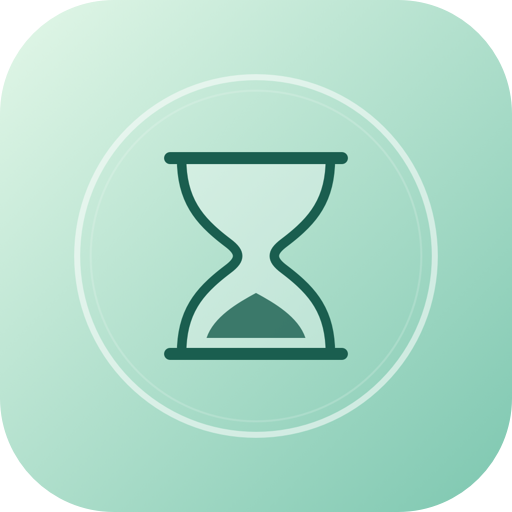
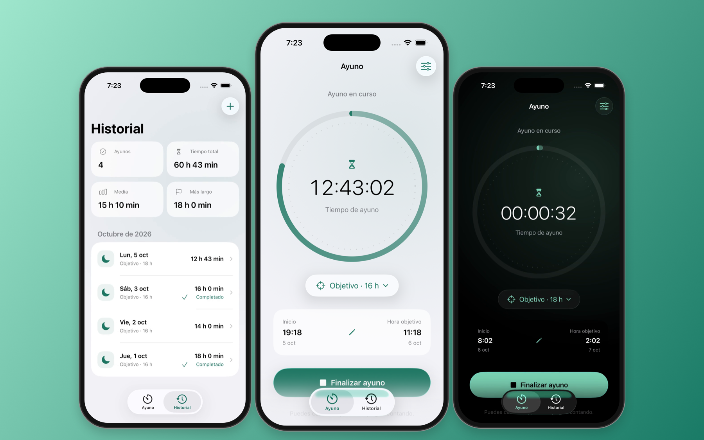
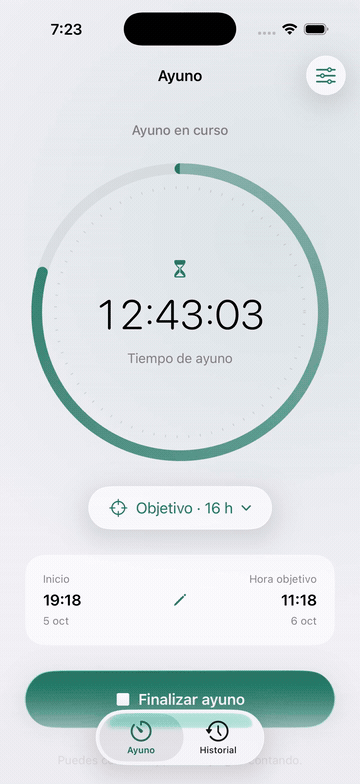
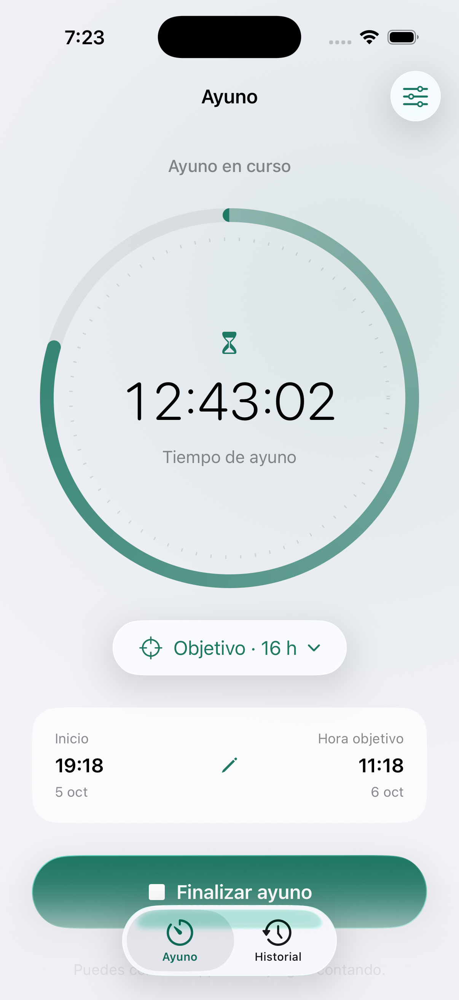
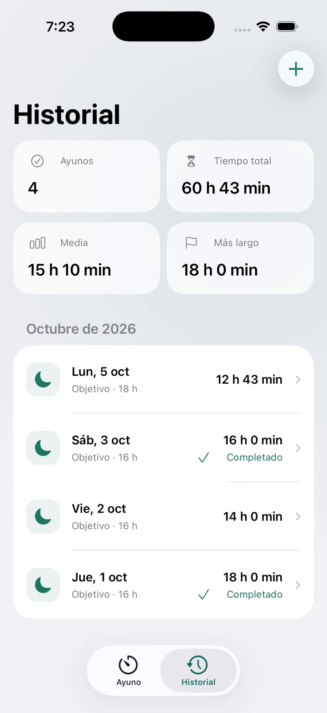
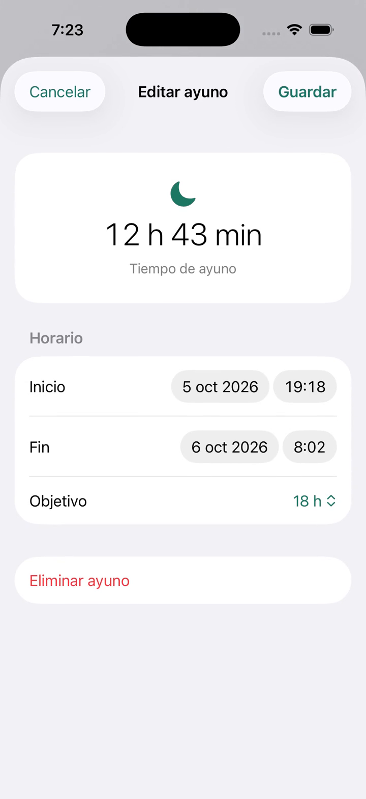
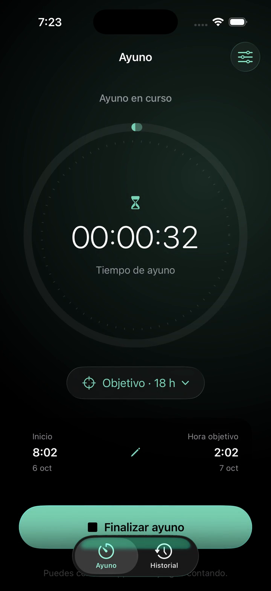
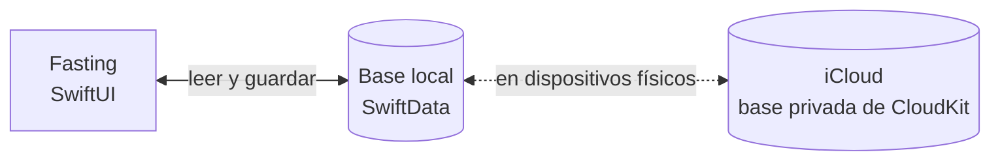

<p align="center">
  
</p>

<h1 align="center">Fasting</h1>

<p align="center">
  <strong>Tu ayuno, a tu ritmo.</strong>
</p>

<p align="center">
  Un cronómetro sencillo, un objetivo a tu medida y todos tus ayunos en un mismo lugar.<br>
  Hecha en Swift para iPhone y iPad, con tus datos guardados en el dispositivo.
</p>

<p align="center">
  
  
  
  
</p>

<p align="center">
  
</p>

<p align="center">
  <sub>Fasting es el nombre provisional. Las imágenes muestran la app real con ayunos de ejemplo.</sub>
</p>

## Funciones

- **Un reloj que sigue contando.** El tiempo se calcula desde la fecha de inicio guardada. Puedes cerrar la app, bloquear el teléfono o reiniciarlo y continuar donde lo dejaste.
- **Tu propio objetivo.** Elige entre 1 y 48 horas y sigue el progreso en el anillo central. Puedes cambiarlo durante un ayuno.
- **Empieza cuando empezaste.** Ajusta la hora de inicio si ya llevabas un rato ayunando.
- **Tu historial, de un vistazo.** Ayunos agrupados por mes, duración de cada sesión, tiempo total, media y ayuno más largo.
- **Corrige lo que necesites.** Añade ayunos anteriores, edita sus horarios y objetivo o elimínalos con confirmación.
- **Nativa y accesible.** Liquid Glass en iOS 26, controles nativos en iOS 17–18, modo claro y oscuro, Dynamic Type, VoiceOver, español e inglés.
- **Simple y privada.** SwiftData en el dispositivo y sincronización privada con iCloud mediante CloudKit. Sin Firebase, cuentas propias, anuncios ni analítica.

## Así funciona

<p align="center">
  
</p>

<p align="center">
  <a href="docs/demo/fasting-demo-es.mp4"><strong>Ver el vídeo completo · 1 min 59 s</strong></a><br>
  <sub>Grabación real del simulador en español. El GIF es un resumen con cortes y reproducción a 1,25×.</sub>
</p>

<table>
  <tr>
    <td align="center" width="25%"></td>
    <td align="center" width="25%"></td>
    <td align="center" width="25%"></td>
    <td align="center" width="25%"></td>
  </tr>
  <tr>
    <td align="center"><sub>Tu tiempo, en el centro</sub></td>
    <td align="center"><sub>Todos tus ayunos</sub></td>
    <td align="center"><sub>Horarios a tu medida</sub></td>
    <td align="center"><sub>También en modo oscuro</sub></td>
  </tr>
</table>

Los [ajustes y la información de privacidad](docs/assets/fasting-settings.png) están a un toque del cronómetro.

## Primeros pasos

1. **Elige tu objetivo.** Toca el botón debajo del reloj y selecciona la duración.
2. **Empieza un ayuno.** Confirma la hora de inicio; puedes ajustarla si ya habías empezado.
3. **Vuelve cuando quieras.** El cronómetro conserva el inicio aunque cierres la app.
4. **Finaliza y guarda.** El ayuno pasa al Historial, donde puedes consultarlo y editarlo.

En **Historial**, el botón **+** permite añadir sesiones anteriores. En **Ajustes** puedes cambiar el objetivo predeterminado y consultar la disponibilidad de tu cuenta de iCloud.

## Datos y privacidad

| | |
| --- | --- |
| **Qué se guarda** | Un UUID, la fecha de inicio, la fecha de fin opcional y el objetivo de cada ayuno. El objetivo predeterminado se guarda en UserDefaults. |
| **Dónde se guarda** | Una base SwiftData en `Application Support/Fasting/Fasting.store`, dentro del sandbox de la app. |
| **iCloud** | En dispositivos físicos, SwiftData solicita sincronización con la base privada de CloudKit de tu cuenta de Apple. El cronómetro funciona sin conexión. El simulador usa únicamente almacenamiento local. |
| **Cuentas y seguimiento** | No hay registro propio, anuncios, analítica ni SDK de terceros. El [manifiesto de privacidad](Fasting/Resources/PrivacyInfo.xcprivacy) declara que no se recopilan datos ni se realiza seguimiento. |
| **Permisos** | No se solicita acceso a HealthKit ni se leen datos de otras apps. |
| **Si falla un guardado** | La operación se revierte y se muestra el error. Si no se puede abrir la base, se conserva y se ofrece reintentar. |

La sincronización con iCloud es eventual. Ajustes muestra la disponibilidad de la cuenta, no una confirmación de que todos los cambios se hayan sincronizado. Si dos dispositivos sin conexión inician ayunos distintos, se conservan ambos y se pueden gestionar desde Historial.

Eliminar una sesión se propaga a los dispositivos sincronizados. Borrar la app elimina su copia local; recuperar el historial desde iCloud requiere que los registros se hayan sincronizado previamente.

## Hecha con

- **Swift y SwiftUI** para toda la interfaz.
- **SwiftData** para la persistencia local.
- **CloudKit** para la sincronización con la base privada de iCloud.
- **Liquid Glass** en iOS 26, con alternativas nativas para versiones anteriores.
- **XCTest** para las pruebas de almacenamiento y los recorridos de interfaz.
- Un **String Catalog** para español e inglés.

Sin paquetes de terceros en la app. La estructura sigue las convenciones de [ios-clipboard](https://github.com/kecoma1/ios-clipboard).

## Arquitectura



El reloj deriva su tiempo de la fecha de inicio persistida. Los cambios se guardan explícitamente, con validación y recuperación ante errores; no hace falta mantener un proceso funcionando en segundo plano.

| Ruta | Contenido |
| --- | --- |
| `Fasting/App/` | Entrada de la app y apertura de la base |
| `Fasting/Models/` | Sesión, estadísticas y formato del reloj |
| `Fasting/Storage/` | Validación y persistencia SwiftData/CloudKit |
| `Fasting/Views/` | Cronómetro, historial, editores, ajustes y estilos |
| `Fasting/Resources/` | Traducciones, icono, color y manifiesto de privacidad |
| `Tests/` | Pruebas de almacenamiento y continuidad del reloj |
| `UITests/` | Flujos de interfaz y recorrido de grabación |
| `docs/` | Galería, vídeo y [resultados de validación](docs/VALIDATION.md) |
| `scripts/` | Generación del proyecto, icono y materiales del README |

## Compilar desde el código

**Requisitos**

- Un Mac con **Xcode 26.3**, la versión con la que se desarrolla el proyecto.
- **iOS 17** o posterior, en iPhone o iPad.
- No hay paquetes de la app que instalar.

**Ejecutar en el simulador.** No requiere una cuenta de desarrollador ni iCloud:

```sh
git clone https://github.com/kecoma1/ios-fasting.git
cd ios-fasting
open iOSFasting.xcodeproj
```

Selecciona el esquema **Fasting**, elige un simulador de iPhone y pulsa Run. El proyecto Xcode ya está incluido.

**Ejecutar en un iPhone e integrar iCloud.** En **Signing & Capabilities**:

1. Selecciona tu equipo de Apple Developer. El proyecto apunta inicialmente al equipo del autor.
2. Registra el bundle ID `com.kecoma.fasting` y el contenedor `iCloud.com.kecoma.fasting`, o utiliza tus propios identificadores.
3. Activa **iCloud / CloudKit**, **Push Notifications** y **Background Modes / Remote notifications**. El proyecto ya incluye las capacidades y entitlements.
4. Si cambias el contenedor, actualiza `Fasting/Fasting.entitlements` y `Persistence.cloudContainerID` en `Fasting/Storage/Persistence.swift`.
5. En un dispositivo firmado y con sesión iniciada en iCloud, ejecuta una compilación Debug con **`-InitializeCloudKitSchema`**. El argumento está incluido, desactivado, en el esquema compartido.
6. Comprueba el esquema en [CloudKit Console](https://icloud.developer.apple.com) y despliégalo a producción antes de distribuir la app.
7. Comprueba con dos dispositivos de la misma cuenta de Apple que iniciar, finalizar, editar y eliminar ayunos se sincroniza.

La integración está implementada; **la sincronización real entre dispositivos sigue pendiente de validar** con un contenedor aprovisionado y dispositivos firmados. Las compilaciones y pruebas del simulador no comprueban iCloud. Consulta el [registro de validación](docs/VALIDATION.md) para conocer lo que se ha probado.

## Pruebas

El esquema **Fasting** incluye:

- **`FastingStoreTests`**, con 11 pruebas de persistencia, validación de fechas y objetivos, recuperación de guardados fallidos, estadísticas y continuidad del reloj.
- **`FastingUITests`**, con flujos de inicio y finalización, edición del historial, español y texto de accesibilidad.

```sh
xcodebuild test -project iOSFasting.xcodeproj -scheme Fasting \
  -destination 'platform=iOS Simulator,name=iPhone 17 Pro' \
  -parallel-testing-enabled NO CODE_SIGNING_ALLOWED=NO
```

Usa un simulador dedicado. Las pruebas abren bases independientes mediante `-UITestStore <UUID>` en Debug y conservan la base normal. Los resultados de XCTest se generan en `build/`.

## Proyecto y materiales visuales

Si añades o quitas archivos de código, regenera el proyecto sin instalar XcodeGen:

```sh
python3 scripts/create_project.py
```

Para regenerar el icono con AppKit:

```sh
swift scripts/draw_icon.swift
```

Para grabar el vídeo, usa un simulador dedicado ya arrancado y **FFmpeg** instalado:

```sh
python3 scripts/record_demo.py --device <UDID-del-simulador>
```

El esquema **FastingDemo** ejecuta el recorrido con pausas y una base independiente de ayunos ficticios, disponible solo en Debug. El esquema normal omite esta prueba de grabación.

La portada combina capturas reales en marcos de iPhone dibujados con AppKit. La galería y el GIF se extraen del vídeo guardado con FFmpeg:

```sh
python3 scripts/create_readme_assets.py
```

Si sustituyes el vídeo por otra grabación, ajusta los tiempos de los fotogramas y los cortes en ese script. No se necesita instalar ningún paquete de Python.

## Contribuir

Puedes [abrir una incidencia](https://github.com/kecoma1/ios-fasting/issues) con tu versión de iOS, dispositivo y pasos para reproducir el problema. Las propuestas y los pull requests deben mantener la app sencilla, nativa y sin dependencias externas.

El nombre y los identificadores son provisionales. Aún no se incluye configuración de App Store Connect, widgets, Live Activities ni monetización.

## Licencia

El proyecto todavía no tiene una licencia.

## Referencias de Apple

- [Sincronización de modelos SwiftData con iCloud](https://developer.apple.com/documentation/swiftdata/syncing-model-data-across-a-persons-devices).
- [Liquid Glass en vistas SwiftUI](https://developer.apple.com/documentation/swiftui/applying-liquid-glass-to-custom-views).
