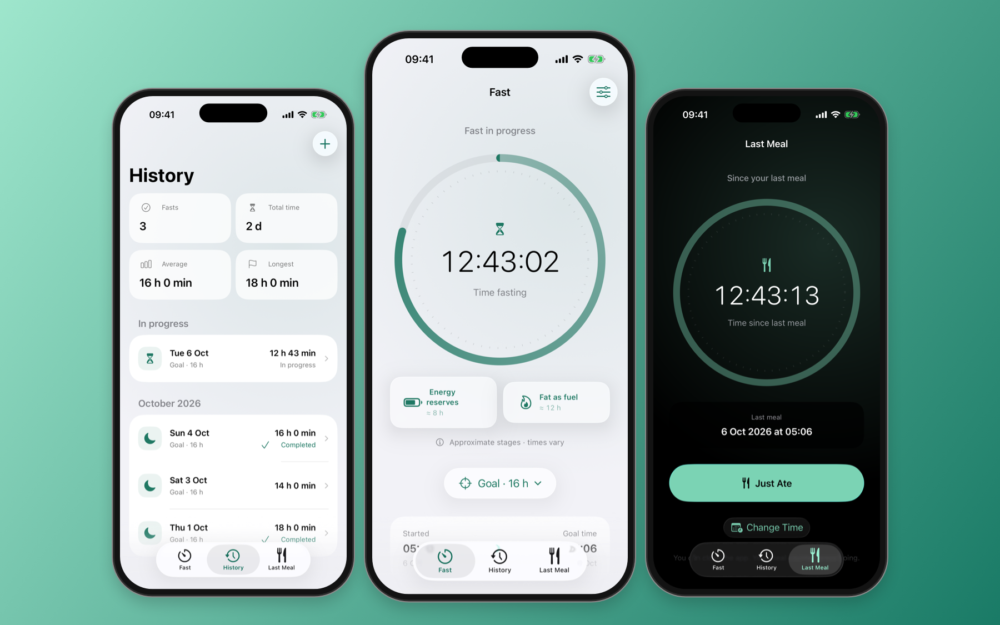
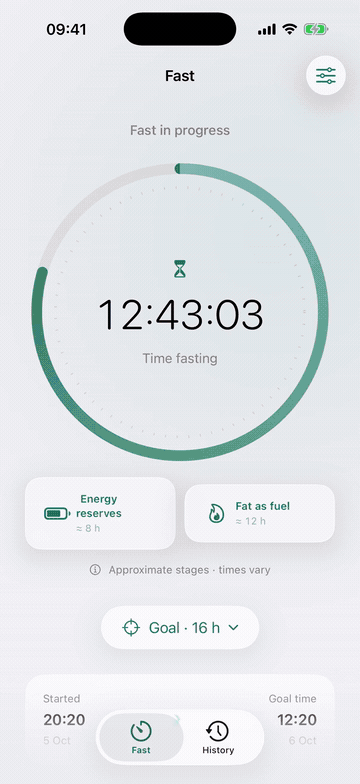
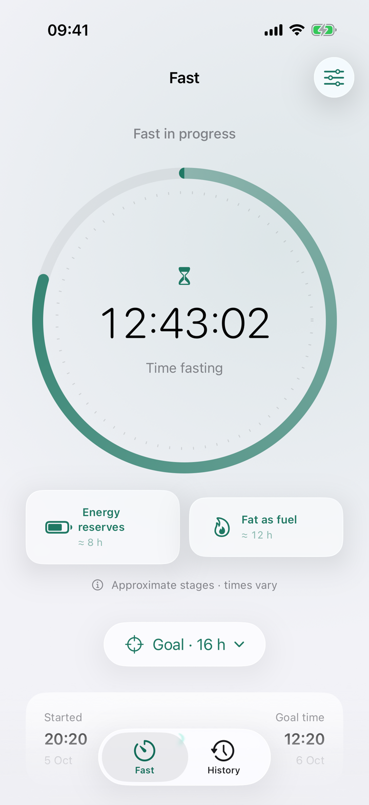
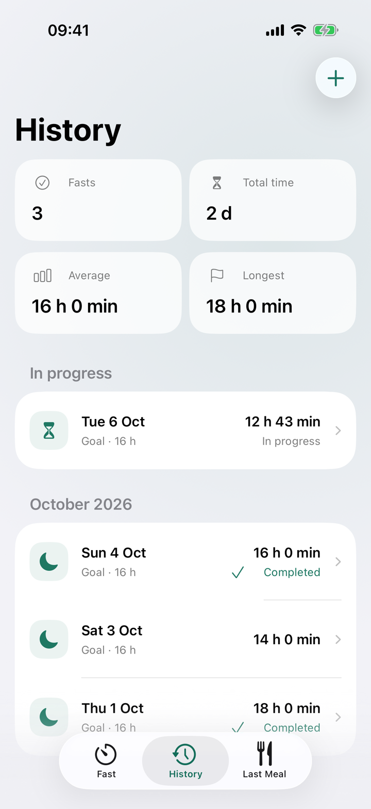
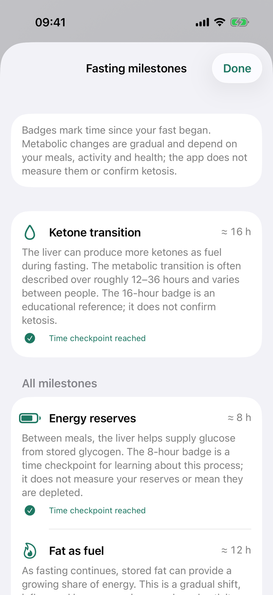
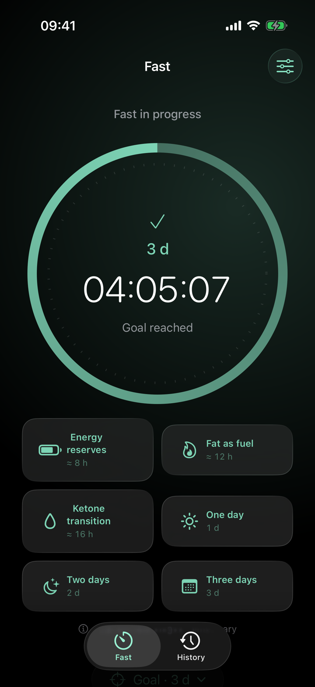
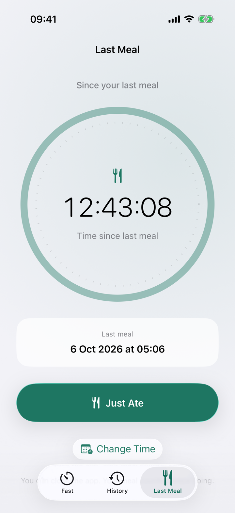
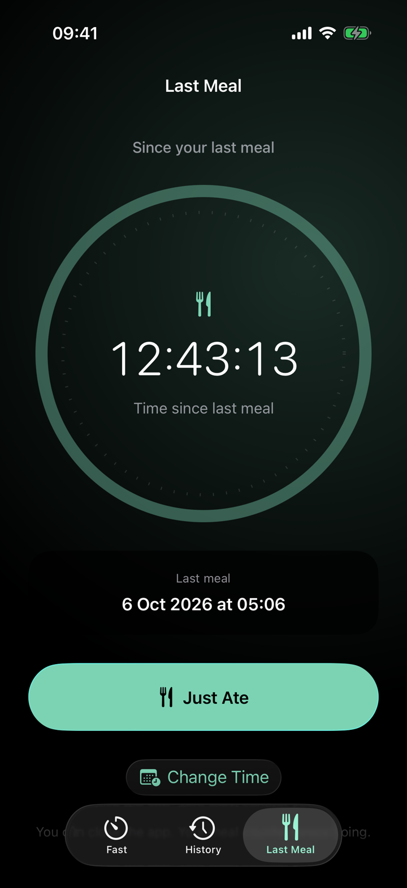
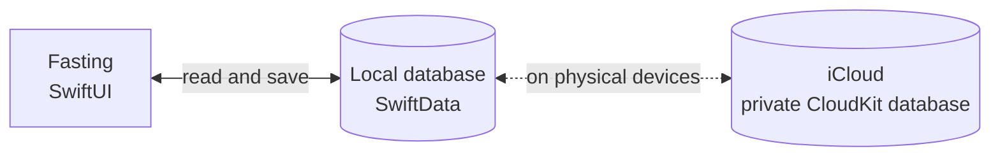

<p align="center">
  
</p>

<h1 align="center">Fasting</h1>

<p align="center">
  <strong>Your fast, at your pace.</strong>
</p>

<p align="center">
  A simple timer, a goal that fits you, and all your fasts in one place.<br>
  Built in Swift for iPhone and iPad, with your data stored on your device.
</p>

<p align="center">
  
  
  
  
</p>

<p align="center">
  
</p>

<p align="center">
  <sub>The real app's three tabs, shown in English with sample data. Fasting is the working name.</sub>
</p>

## Features

- **A timer that keeps going.** Elapsed time is calculated from the saved start date. Close the app, lock your phone, or restart it, then pick up where you left off.
- **Hours or days.** Choose a goal from 1 hour to 365 days, including mixed durations such as 3 days and 4 hours. The timer shows days separately from `HH:MM:SS` and keeps counting after the goal; it never ends a fast automatically.
- **Milestones below your timer.** Small badges accumulate at 8, 12, 16, 24, 48 and 72 hours. Tap one to learn about energy reserves, fat as fuel, ketone production or the elapsed-day checkpoint. Early metabolic stages are approximate educational references; the app does not measure metabolism or confirm ketosis.
- **Start when you actually started.** Adjust the start time if you have already been fasting for a while.
- **Time since your last meal.** A third tab lets you tap **Just Ate** or choose the meal's date and time. Its separate counter shows hours, minutes, seconds and elapsed days, and remembers the last saved time after reopening the app.
- **Your history at a glance.** Fasts grouped by month, each session's duration, total time, average duration, and longest fast.
- **Make corrections.** Add past fasts, edit their times and goals, or delete them with confirmation.
- **Native and accessible.** Liquid Glass on iOS 26, native controls on iOS 17–18, light and dark mode, Dynamic Type, VoiceOver, English and Spanish.
- **Simple and private.** On-device SwiftData storage and private iCloud sync through CloudKit. No Firebase, separate accounts, ads, or analytics.

## See it in action

<p align="center">
  
</p>

<p align="center">
  <a href="docs/demo/fasting-demo-en.mp4"><strong>Watch the full video in English · 2 min 31 s</strong></a><br>
  <sub>Real simulator recording of Fast and History in English. The GIF is an excerpt with cuts and 1.25× playback.</sub>
</p>

<table>
  <tr>
    <td align="center" width="25%"></td>
    <td align="center" width="25%"></td>
    <td align="center" width="25%"></td>
    <td align="center" width="25%"></td>
  </tr>
  <tr>
    <td align="center"><sub>Your time, front and center</sub></td>
    <td align="center"><sub>All your fasts</sub></td>
    <td align="center"><sub>Learn about each milestone</sub></td>
    <td align="center"><sub>Dark mode, too</sub></td>
  </tr>
</table>

<p align="center">
  
  
  <br><sub>Log your last meal in one tap, or choose when you finished eating.</sub>
</p>

[Settings and privacy information](docs/assets/fasting-settings-en.png) are one tap away from the timer. The [session editor](docs/assets/fasting-editor-en.png) lets you adjust saved times and goals.

Multi-day examples: [a timer after three days](docs/assets/milestones-multiday-en.png), [the full duration in History](docs/assets/history-multiday-en.png), and [choosing a three-day goal](docs/assets/goal-multiday-en.png). A day represents 24 elapsed hours.

## Getting started

1. **Choose your goal.** Tap the button below the timer and select days and hours. For a three-day goal, choose **3 days, 0 hours**.
2. **Start a fast.** Confirm the start time, or adjust it if you already began.
3. **Come back whenever you like.** The timer remembers the start date even when you close the app.
4. **Finish and save.** Your fast moves to History, where you can review and edit it.

In **History**, the **+** button lets you add past sessions. In **Settings**, you can change the default goal and check your iCloud account's availability.

In **Last Meal**, tap **Just Ate** when you finish eating, or **Choose Time** to enter an earlier date and time. **Change Time** lets you correct it later. Each new meal starts this counter again; logging a meal does not start or finish a fasting session.

## Data and privacy

| | |
| --- | --- |
| **What is stored** | A UUID, the start date, an optional end date, and the goal for each fast. Meal entries store a UUID, the meal time and when the entry was saved. The default goal is stored in UserDefaults. |
| **Where it is stored** | A SwiftData database at `Application Support/Fasting/Fasting.store`, inside the app's sandbox. |
| **iCloud** | On physical devices, SwiftData requests synchronization with your Apple Account's private CloudKit database. The timer works offline. The simulator uses local storage only. |
| **Accounts and tracking** | No separate registration, ads, analytics, or third-party SDKs. The [privacy manifest](Fasting/Resources/PrivacyInfo.xcprivacy) declares no data collection or tracking. |
| **Permissions** | The app does not request HealthKit access or read data from other apps. |
| **If a save fails** | The operation is rolled back and an error is shown. If the database cannot be opened, it is preserved and you can retry. |

Sync with iCloud is eventual. Settings shows account availability, not confirmation that every change has finished syncing. If two offline devices start different fasts, both sessions are preserved and can be managed in History.

Meal registrations and corrections are saved as separate entries in the same database. The newest saved action determines the last-meal counter, even when it corrects the meal time to an earlier date. Equal save times are resolved consistently by entry ID when devices merge records.

Deleting a session propagates to synced devices. Deleting the app removes its local copy; restoring history from iCloud requires the records to have synced beforehand.

## Built with

- **Swift and SwiftUI** for the entire interface.
- **SwiftData** for local persistence.
- **CloudKit** for synchronization with the private iCloud database.
- **Liquid Glass** on iOS 26, with native alternatives for earlier versions.
- **XCTest** for storage tests and UI walkthroughs.
- A **String Catalog** for English and Spanish.

No third-party app packages. The structure follows the conventions of [ios-clipboard](https://github.com/kecoma1/ios-clipboard).

## Architecture



The fasting timer derives elapsed time from the persisted start date; the last-meal counter uses the saved meal time. Changes are saved explicitly, with validation and recovery from errors; no background process needs to keep running.

| Path | Contents |
| --- | --- |
| `Fasting/App/` | App entry point and database initialization |
| `Fasting/Models/` | Fasting sessions, meal entries, statistics, and timer formatting |
| `Fasting/Storage/` | Validation and SwiftData/CloudKit persistence |
| `Fasting/Views/` | Fasting timer, history, last-meal counter, editors, settings, and styles |
| `Fasting/Resources/` | Translations, icon, color, and privacy manifest |
| `Tests/` | Storage tests and timer continuity |
| `UITests/` | UI flows and recording walkthrough |
| `docs/` | Gallery, video, and [validation results](docs/VALIDATION.md) |
| `scripts/` | Project, icon, and README asset generation |

## Building from source

**Requirements**

- A Mac with **Xcode 26.3**, the version used to develop the project.
- **iOS 17** or later, on iPhone or iPad.
- No app packages to install.

**Run in the Simulator.** No Apple Developer account or iCloud is required:

```sh
git clone https://github.com/kecoma1/ios-fasting.git
cd ios-fasting
open iOSFasting.xcodeproj
```

Select the **Fasting** scheme, choose an iPhone simulator, and run. The Xcode project is already included.

**Run on an iPhone and set up iCloud.** In **Signing & Capabilities**:

1. Select your Apple Developer team. The project initially points to the author's team.
2. Register the bundle ID `com.rento.fasting` and container `iCloud.com.rento.fasting`, or use your own identifiers.
3. Enable **iCloud / CloudKit**, **Push Notifications**, and **Background Modes / Remote notifications**. The project already includes the capabilities and entitlements.
4. If you change the container, update `Fasting/Fasting.entitlements` and `Persistence.cloudContainerID` in `Fasting/Storage/Persistence.swift`.
5. On a signed device logged in to iCloud, run a Debug build with **`-InitializeCloudKitSchema`**. The argument is included in the shared scheme but disabled.
6. Check the schema in [CloudKit Console](https://icloud.developer.apple.com) and deploy it to production before distributing the app.
7. Check on two devices signed in to the same Apple Account that fasts stay in sync when you start, finish, edit, or delete them.

The author's CloudKit container is registered and its fasting and meal schemas are deployed to production. **Real synchronization between two devices still needs validation.** Simulator builds and tests do not verify iCloud. See the [validation log](docs/VALIDATION.md) for what has been tested.

## Testing

The **Fasting** scheme includes:

- **`FastingStoreTests`**, with 16 tests covering persistence, date and goal validation, recovery from failed saves, statistics, timer continuity, multi-day fasts, and milestone boundaries, edits and resets.
- **`MealStoreTests`**, with six tests covering independent counters, reopening the database, corrections, future-date rejection, repeated save failures, deterministic merging, and preserving old fasting databases when the meal model is added.
- **`FastingUITests`**, covering starting and finishing fasts, history editing, Spanish, accessibility text sizes, choosing goals in days, reopening and saving a multi-day fast, cumulative milestone badges and their explanations, and recording, correcting and reopening the last-meal counter.

```sh
xcodebuild test -project iOSFasting.xcodeproj -scheme Fasting \
  -destination 'platform=iOS Simulator,name=iPhone 17 Pro' \
  -parallel-testing-enabled NO CODE_SIGNING_ALLOWED=NO
```

Use a dedicated simulator. The tests open independent databases through `-UITestStore <UUID>` in Debug and preserve the normal database. XCTest results are generated in `build/`.

## Project and visual assets

If you add or remove source files, regenerate the project without installing XcodeGen:

```sh
python3 scripts/create_project.py
```

To regenerate the icon with AppKit:

```sh
swift scripts/draw_icon.swift
```

To record the video, use an already booted dedicated simulator with **FFmpeg** installed:

```sh
python3 scripts/record_demo.py --device <simulator-UDID> --language en
```

The **FastingDemo** scheme runs the walkthrough with pauses and independent databases of sample fasts, available only in Debug. English is the recording script's default. The normal scheme skips these recording walkthroughs.

To refresh the current three-tab screenshots and cover without recording the full video:

```sh
python3 scripts/capture_readme.py --device <simulator-UDID>
```

The cover follows the three-iPhone composition in `ios-clipboard`: aligned side devices and a larger phone in the center, with a mint and emerald background. Every screen is a real English screenshot. AppKit draws the frames, XCTest captures the gallery, and FFmpeg creates the GIF from the saved video:

```sh
python3 scripts/create_readme_assets.py
```

The recording exports named screenshots and a timing manifest. Its optional `clips` values hold visually reviewed video offsets when simulator recording timing differs from capture timing. No Python packages need to be installed.

## Contributing

[Open an issue](https://github.com/kecoma1/ios-fasting/issues) with your iOS version, device, and steps to reproduce the problem. Proposals and pull requests should keep the app simple, native, and free of external dependencies.

The app name is provisional. Version **0.1.0 (1)** is available to the author's internal TestFlight group. Widgets, Live Activities, and monetization are not included yet.

## License

This project does not have a license yet.

## Apple references

- [Syncing SwiftData models with iCloud](https://developer.apple.com/documentation/swiftdata/syncing-model-data-across-a-persons-devices).
- [Liquid Glass in SwiftUI views](https://developer.apple.com/documentation/swiftui/applying-liquid-glass-to-custom-views).

## Milestone references

The 8-, 12- and 16-hour badges introduce overlapping metabolic processes at time checkpoints chosen for this interface. They are not exact biological thresholds. The shift toward greater use of fatty acids and ketones varies with previous meals, activity and individual physiology, and is commonly described across roughly 12–36 hours. The 24-, 48- and 72-hour badges simply record elapsed time. Badge state is derived from the saved start date, so reopening the app or correcting a start time keeps it consistent.

- [Flipping the Metabolic Switch (2018 review)](https://pmc.ncbi.nlm.nih.gov/articles/PMC5783752/).
- [Impaired ketogenesis and increased acetyl-CoA oxidation promote hyperglycemia in human fatty liver (2019 human study)](https://doi.org/10.1172/jci.insight.127737).
