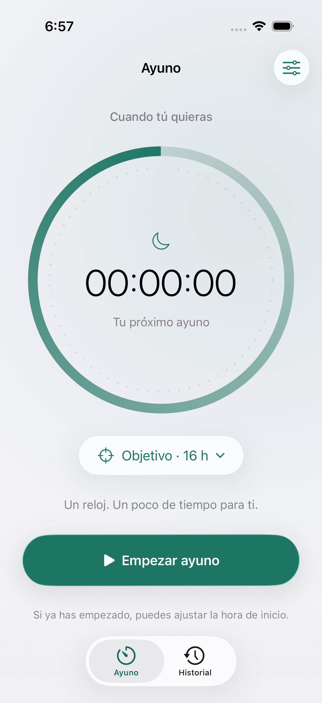
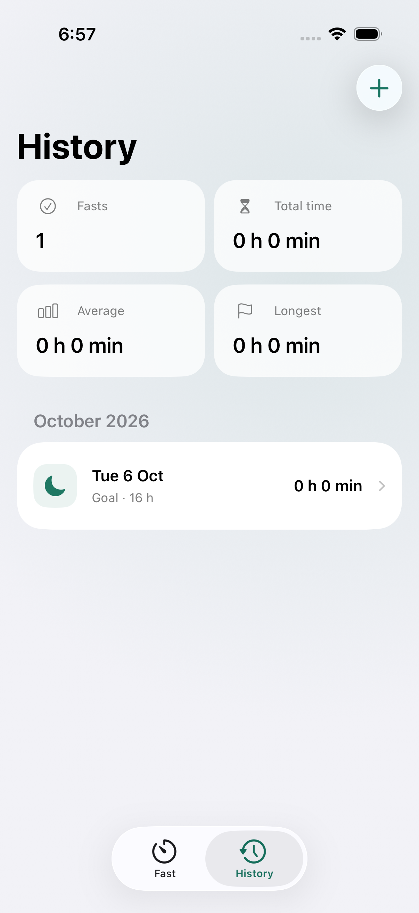
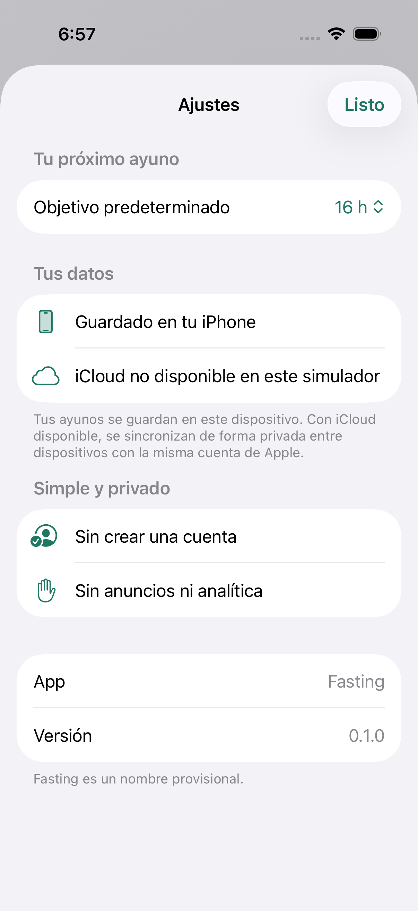

# Fasting

Una app de ayuno para iPhone y iPad, con un nombre provisional. Hecha en Swift y SwiftUI, siguiendo la base nativa de [ios-clipboard](https://github.com/kecoma1/ios-clipboard).

## Qué incluye

- Cronómetro central y anillo de progreso hacia un objetivo configurable.
- Inicio ajustable si ya habías empezado a ayunar.
- El ayuno continúa al cerrar la app, bloquear el teléfono o reiniciar el dispositivo: el reloj calcula el tiempo desde la fecha guardada.
- Historial agrupado por mes, con duración, número de ayunos, tiempo total, media y ayuno más largo.
- Añadir ayunos anteriores, corregir sus horarios y objetivo, y eliminarlos con confirmación.
- SwiftData para almacenamiento local y CloudKit para sincronización privada con iCloud en dispositivos físicos.
- Liquid Glass en iOS 26, con controles nativos alternativos en iOS 17–18.
- Español e inglés, modo claro y oscuro, Dynamic Type y etiquetas para VoiceOver.
- Icono provisional dibujado con código nativo, sin dependencias externas.

Sin Firebase, servidor, registro, anuncios, analítica ni paquetes de terceros.

## Vista previa

Vídeo real del simulador, en español y con datos de ejemplo: [ver o descargar la demo](docs/demo/fasting-demo-es.mp4) (1 min 59 s, 3,1 MB). Muestra el cronómetro, el objetivo, la finalización de un ayuno, el historial, los editores, los ajustes y el modo oscuro. También está disponible la [captura inicial con el ayuno en curso](docs/demo/poster.png).

Capturas reales del simulador de iPhone 17 Pro. El historial de esta captura contiene un ayuno breve creado durante las pruebas.

<p align="center">
  
  
  
</p>

También disponible en [modo oscuro](docs/assets/timer-dark-es.png).

Para volver a grabar el recorrido, usa un simulador dedicado ya arrancado y FFmpeg instalado:

```sh
python3 scripts/record_demo.py --device <UDID-del-simulador>
```

El esquema **FastingDemo** ejecuta el recorrido con pausas para la grabación. Crea una base independiente con ayunos ficticios, disponible solo en Debug; no cambia la base normal ni usa iCloud. El esquema **Fasting** omite esta prueba de grabación. El MP4 se guarda en `docs/demo/` y los resultados de XCTest y la captura original en `build/`.

## Ejecutar

Requisitos: macOS, Xcode 26.3 y un simulador o dispositivo con iOS 17 o posterior.

```sh
git clone https://github.com/kecoma1/ios-fasting.git
cd ios-fasting
open iOSFasting.xcodeproj
```

Selecciona el esquema **Fasting**, elige un simulador de iPhone y pulsa Run. El simulador usa una base local; no necesita cuenta de desarrollador ni iCloud.

La app tiene dos pestañas: **Ayuno** e **Historial**. Desde Ayuno puedes elegir un objetivo, empezar y finalizar. Desde Historial puedes añadir un ayuno anterior o tocar uno para editarlo o eliminarlo. El botón de ajustes permite cambiar el objetivo de los siguientes ayunos y consultar la disponibilidad de iCloud.

## iPhone e iCloud

La integración está implementada, pero un nuevo contenedor requiere aprovisionamiento en la cuenta de Apple Developer antes de poder comprobar la sincronización entre dispositivos:

1. En **Signing & Capabilities**, selecciona tu equipo. Se usa el mismo equipo que `ios-clipboard` como valor inicial: `6GDZU4K9BF`.
2. Registra el bundle ID `com.kecoma.fasting` y el contenedor `iCloud.com.kecoma.fasting`, o cambia ambos por tus identificadores.
3. Activa **iCloud / CloudKit**, **Push Notifications** y **Background Modes / Remote notifications**. El proyecto ya incluye las capacidades, entitlements y configuración de compilación correspondientes.
4. Si cambias el contenedor, actualiza tanto `Fasting/Fasting.entitlements` como `Persistence.cloudContainerID` en `Fasting/Storage/Persistence.swift`.
5. En un dispositivo firmado y con sesión iniciada en iCloud, ejecuta una compilación Debug con el argumento **`-InitializeCloudKitSchema`**. Está disponible, desactivado, en el esquema compartido.
6. Comprueba el esquema en [CloudKit Console](https://icloud.developer.apple.com). Antes de distribuir la app, despliega el esquema a producción.
7. Comprueba con dos dispositivos de la misma cuenta de Apple que un ayuno iniciado en uno aparece en el otro, que finalizarlo actualiza ambos y que editar o eliminar el historial también se sincroniza.

En dispositivos físicos SwiftData guarda localmente y solicita sincronización automática con la base privada de CloudKit. La sincronización es eventual y depende de la cuenta de Apple, la conectividad y el sistema; el reloj funciona sin conexión. En Ajustes se muestra la **disponibilidad de la cuenta**, no una afirmación de que todos los cambios hayan terminado de sincronizarse.

Si dos dispositivos sin conexión inician ayunos distintos, se conservan ambos. Ayuno muestra el más reciente y avisa del conflicto; Historial permite finalizar o eliminar cada sesión. No se descarta ningún ayuno silenciosamente.

## Datos y privacidad

La base SwiftData guarda un UUID, fecha de inicio, fecha de fin opcional y objetivo de duración para cada sesión. El objetivo predeterminado se guarda en UserDefaults. No se solicita acceso a HealthKit ni se recopilan datos de uso.

En el teléfono, la base se encuentra en `Application Support/Fasting/Fasting.store`, dentro del sandbox de la app. En dispositivos físicos CloudKit utiliza la base privada asociada a la cuenta de Apple del usuario. Borrar una sesión se propaga a los dispositivos sincronizados. Borrar la app elimina la copia local; la recuperación desde iCloud requiere que los registros se hayan sincronizado previamente.

Los cambios se guardan de forma explícita. Si un guardado falla, se revierte la operación y se muestra el error. Si la base no puede abrirse, se conserva y se ofrece reintentar: no se elimina ni se sustituye por una base temporal vacía.

## Estructura

| Ruta | Contenido |
| --- | --- |
| `Fasting/App/` | Entrada de la app y apertura segura de la base |
| `Fasting/Models/` | Sesión, estadísticas y formato del reloj |
| `Fasting/Storage/` | Operaciones con validación y persistencia SwiftData/CloudKit |
| `Fasting/Views/` | Cronómetro, historial, editores, ajustes y estilos adaptativos |
| `Fasting/Resources/` | Catálogo de textos, icono, color y manifiesto de privacidad |
| `Tests/` | Pruebas de almacenamiento, fechas, estadísticas y continuidad del reloj |
| `UITests/` | Flujos de inicio/finalización, historial, español y texto grande |
| `scripts/` | Generación reproducible del proyecto Xcode y del icono |

El proyecto Xcode está incluido. Si cambias el conjunto de archivos de código, puedes regenerarlo con Python 3, sin instalar XcodeGen:

```sh
python3 scripts/create_project.py
```

Para regenerar el icono:

```sh
swift scripts/draw_icon.swift
```

## Comprobaciones

Compilar para simulador:

```sh
xcodebuild build -project iOSFasting.xcodeproj -scheme Fasting \
  -destination 'platform=iOS Simulator,name=iPhone 17 Pro' \
  CODE_SIGNING_ALLOWED=NO
```

Ejecutar pruebas de almacenamiento y de interfaz:

```sh
xcodebuild test -project iOSFasting.xcodeproj -scheme Fasting \
  -destination 'platform=iOS Simulator,name=iPhone 17 Pro' \
  -parallel-testing-enabled NO CODE_SIGNING_ALLOWED=NO
```

Las pruebas de interfaz abren bases independientes mediante `-UITestStore <UUID>` en compilaciones Debug. No borran la base normal ni sus ayunos. Los resultados incluyen capturas de las pantallas probadas.

Los identificadores y el nombre de producto son provisionales. No se incluye aún configuración de App Store Connect, monetización, widgets ni Live Activities.

## Referencias de Apple

- [Sincronización de modelos SwiftData con iCloud](https://developer.apple.com/documentation/swiftdata/syncing-model-data-across-a-persons-devices).
- [Liquid Glass en vistas SwiftUI](https://developer.apple.com/documentation/swiftui/applying-liquid-glass-to-custom-views).
