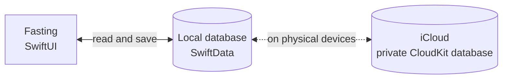

<p align="center">
  
</p>

<h1 align="center">Fasting</h1>

<p align="center">
  <strong>Your fast, at your pace.</strong>
</p>

<p align="center">
  A simple timer, a goal that fits you, and all your fasts in one place.<br>
  Built in Swift for iPhone and iPad, with your data stored on your device.
</p>

<p align="center">
  
  
  
  
</p>

<p align="center">
  
</p>

<p align="center">
  <sub>Fasting is the working name. The images show the real app with sample fasts.</sub>
</p>

## Features

- **A timer that keeps going.** Elapsed time is calculated from the saved start date. Close the app, lock your phone, or restart it, then pick up where you left off.
- **Your own goal.** Choose between 1 and 48 hours and follow your progress in the central ring. You can change the goal during a fast.
- **Start when you actually started.** Adjust the start time if you have already been fasting for a while.
- **Your history at a glance.** Fasts grouped by month, each session's duration, total time, average duration, and longest fast.
- **Make corrections.** Add past fasts, edit their times and goals, or delete them with confirmation.
- **Native and accessible.** Liquid Glass on iOS 26, native controls on iOS 17–18, light and dark mode, Dynamic Type, VoiceOver, English and Spanish.
- **Simple and private.** On-device SwiftData storage and private iCloud sync through CloudKit. No Firebase, separate accounts, ads, or analytics.

## See it in action

<p align="center">
  
</p>

<p align="center">
  <a href="docs/demo/fasting-demo-es.mp4"><strong>Watch the full video · 1 min 59 s</strong></a><br>
  <sub>Real simulator recording in Spanish. The GIF is an excerpt with cuts and 1.25× playback.</sub>
</p>

<table>
  <tr>
    <td align="center" width="25%"></td>
    <td align="center" width="25%"></td>
    <td align="center" width="25%"></td>
    <td align="center" width="25%"></td>
  </tr>
  <tr>
    <td align="center"><sub>Your time, front and center</sub></td>
    <td align="center"><sub>All your fasts</sub></td>
    <td align="center"><sub>Times you can adjust</sub></td>
    <td align="center"><sub>Dark mode, too</sub></td>
  </tr>
</table>

[Settings and privacy information](docs/assets/fasting-settings.png) are one tap away from the timer.

## Getting started

1. **Choose your goal.** Tap the button below the timer and select a duration.
2. **Start a fast.** Confirm the start time, or adjust it if you already began.
3. **Come back whenever you like.** The timer remembers the start date even when you close the app.
4. **Finish and save.** Your fast moves to History, where you can review and edit it.

In **History**, the **+** button lets you add past sessions. In **Settings**, you can change the default goal and check your iCloud account's availability.

## Data and privacy

| | |
| --- | --- |
| **What is stored** | A UUID, the start date, an optional end date, and the goal for each fast. The default goal is stored in UserDefaults. |
| **Where it is stored** | A SwiftData database at `Application Support/Fasting/Fasting.store`, inside the app's sandbox. |
| **iCloud** | On physical devices, SwiftData requests synchronization with your Apple Account's private CloudKit database. The timer works offline. The simulator uses local storage only. |
| **Accounts and tracking** | No separate registration, ads, analytics, or third-party SDKs. The [privacy manifest](Fasting/Resources/PrivacyInfo.xcprivacy) declares no data collection or tracking. |
| **Permissions** | The app does not request HealthKit access or read data from other apps. |
| **If a save fails** | The operation is rolled back and an error is shown. If the database cannot be opened, it is preserved and you can retry. |

Sync with iCloud is eventual. Settings shows account availability, not confirmation that every change has finished syncing. If two offline devices start different fasts, both sessions are preserved and can be managed in History.

Deleting a session propagates to synced devices. Deleting the app removes its local copy; restoring history from iCloud requires the records to have synced beforehand.

## Built with

- **Swift and SwiftUI** for the entire interface.
- **SwiftData** for local persistence.
- **CloudKit** for synchronization with the private iCloud database.
- **Liquid Glass** on iOS 26, with native alternatives for earlier versions.
- **XCTest** for storage tests and UI walkthroughs.
- A **String Catalog** for English and Spanish.

No third-party app packages. The structure follows the conventions of [ios-clipboard](https://github.com/kecoma1/ios-clipboard).

## Architecture



The timer derives elapsed time from the persisted start date. Changes are saved explicitly, with validation and recovery from errors; no background process needs to keep running.

| Path | Contents |
| --- | --- |
| `Fasting/App/` | App entry point and database initialization |
| `Fasting/Models/` | Sessions, statistics, and timer formatting |
| `Fasting/Storage/` | Validation and SwiftData/CloudKit persistence |
| `Fasting/Views/` | Timer, history, editors, settings, and styles |
| `Fasting/Resources/` | Translations, icon, color, and privacy manifest |
| `Tests/` | Storage tests and timer continuity |
| `UITests/` | UI flows and recording walkthrough |
| `docs/` | Gallery, video, and [validation results](docs/VALIDATION.md) |
| `scripts/` | Project, icon, and README asset generation |

## Building from source

**Requirements**

- A Mac with **Xcode 26.3**, the version used to develop the project.
- **iOS 17** or later, on iPhone or iPad.
- No app packages to install.

**Run in the Simulator.** No Apple Developer account or iCloud is required:

```sh
git clone https://github.com/kecoma1/ios-fasting.git
cd ios-fasting
open iOSFasting.xcodeproj
```

Select the **Fasting** scheme, choose an iPhone simulator, and run. The Xcode project is already included.

**Run on an iPhone and set up iCloud.** In **Signing & Capabilities**:

1. Select your Apple Developer team. The project initially points to the author's team.
2. Register the bundle ID `com.kecoma.fasting` and container `iCloud.com.kecoma.fasting`, or use your own identifiers.
3. Enable **iCloud / CloudKit**, **Push Notifications**, and **Background Modes / Remote notifications**. The project already includes the capabilities and entitlements.
4. If you change the container, update `Fasting/Fasting.entitlements` and `Persistence.cloudContainerID` in `Fasting/Storage/Persistence.swift`.
5. On a signed device logged in to iCloud, run a Debug build with **`-InitializeCloudKitSchema`**. The argument is included in the shared scheme but disabled.
6. Check the schema in [CloudKit Console](https://icloud.developer.apple.com) and deploy it to production before distributing the app.
7. Check on two devices signed in to the same Apple Account that fasts stay in sync when you start, finish, edit, or delete them.

The integration is implemented; **real synchronization between devices still needs validation** with a provisioned container and signed devices. Simulator builds and tests do not verify iCloud. See the [validation log](docs/VALIDATION.md) for what has been tested.

## Testing

The **Fasting** scheme includes:

- **`FastingStoreTests`**, with 11 tests covering persistence, date and goal validation, recovery from failed saves, statistics, and timer continuity.
- **`FastingUITests`**, covering starting and finishing fasts, history editing, Spanish, and accessibility text sizes.

```sh
xcodebuild test -project iOSFasting.xcodeproj -scheme Fasting \
  -destination 'platform=iOS Simulator,name=iPhone 17 Pro' \
  -parallel-testing-enabled NO CODE_SIGNING_ALLOWED=NO
```

Use a dedicated simulator. The tests open independent databases through `-UITestStore <UUID>` in Debug and preserve the normal database. XCTest results are generated in `build/`.

## Project and visual assets

If you add or remove source files, regenerate the project without installing XcodeGen:

```sh
python3 scripts/create_project.py
```

To regenerate the icon with AppKit:

```sh
swift scripts/draw_icon.swift
```

To record the video, use an already booted dedicated simulator with **FFmpeg** installed:

```sh
python3 scripts/record_demo.py --device <simulator-UDID>
```

The **FastingDemo** scheme runs the walkthrough with pauses and an independent database of sample fasts, available only in Debug. The normal scheme skips this recording test.

The cover combines real screenshots in iPhone frames drawn with AppKit. The gallery and GIF are extracted from the saved video with FFmpeg:

```sh
python3 scripts/create_readme_assets.py
```

If you replace the video with another recording, adjust the frame times and cuts in that script. No Python packages need to be installed.

## Contributing

[Open an issue](https://github.com/kecoma1/ios-fasting/issues) with your iOS version, device, and steps to reproduce the problem. Proposals and pull requests should keep the app simple, native, and free of external dependencies.

The name and identifiers are provisional. App Store Connect setup, widgets, Live Activities, and monetization are not included yet.

## License

This project does not have a license yet.

## Apple references

- [Syncing SwiftData models with iCloud](https://developer.apple.com/documentation/swiftdata/syncing-model-data-across-a-persons-devices).
- [Liquid Glass in SwiftUI views](https://developer.apple.com/documentation/swiftui/applying-liquid-glass-to-custom-views).
